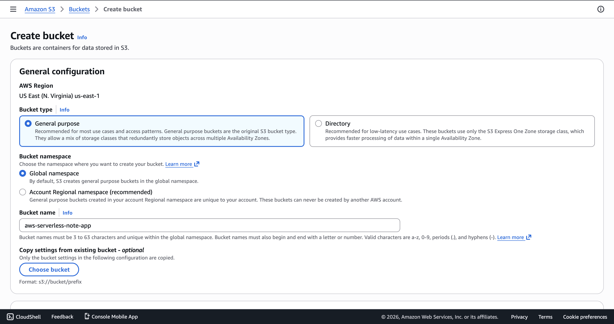
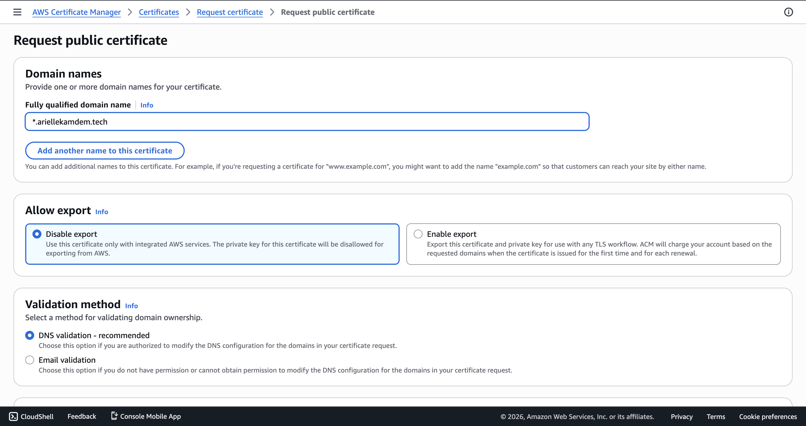
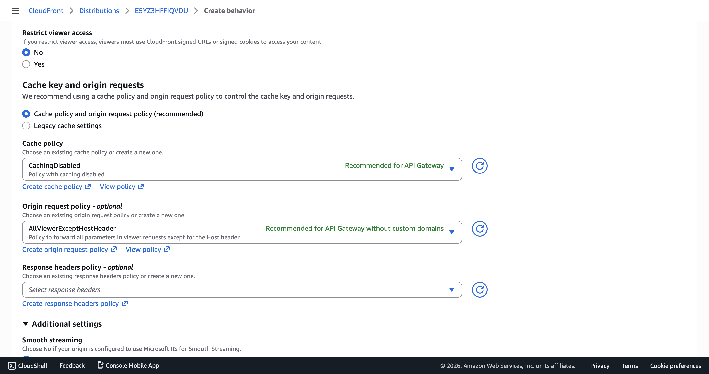
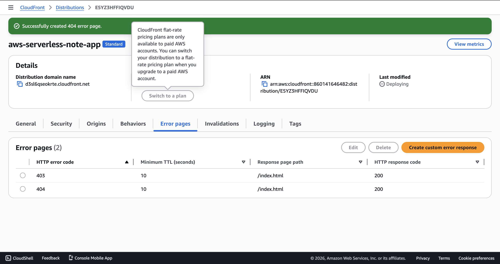
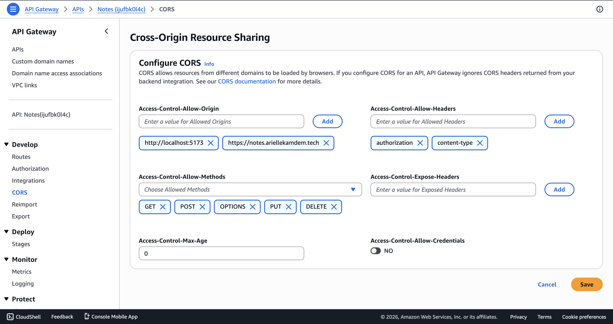
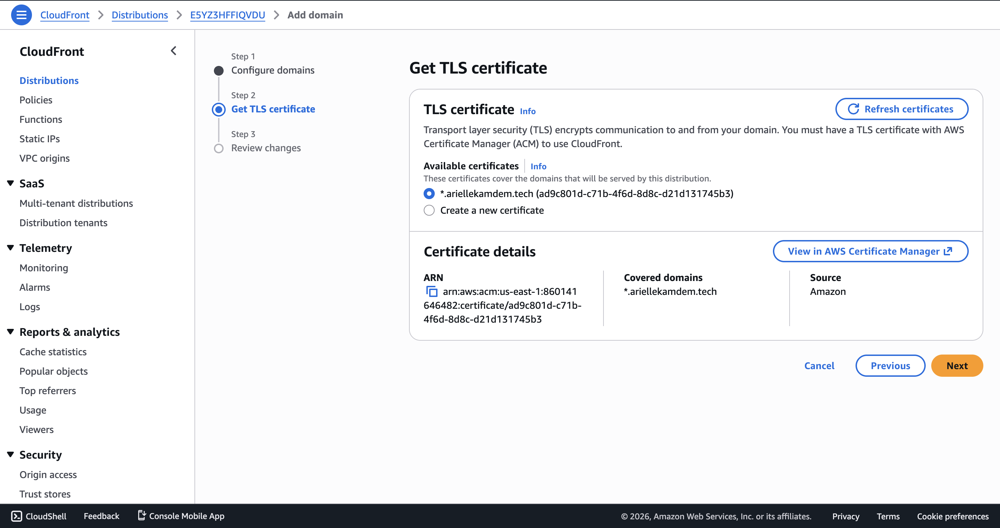

# Deploying the Frontend — S3, CloudFront, Custom Domain & CI/CD

This is a full breakdown of how I deployed my frontend app to AWS, set up a custom subdomain with HTTPS, configured CloudFront to serve both my frontend and API through a single domain, and automated the whole deployment with a GitHub Actions pipeline.

---

## Table of Contents

1. [Creating the S3 Bucket](#1-creating-the-s3-bucket)
2. [Requesting an ACM Certificate for My Subdomain](#2-requesting-an-acm-certificate-for-my-subdomain)
3. [Creating the CloudFront Distribution](#3-creating-the-cloudfront-distribution)
4. [Adding the API as a Second Origin](#4-adding-the-api-as-a-second-origin)
5. [Setting Up Behaviors](#5-setting-up-behaviors)
6. [Handling SPA Routing with Custom Error Pages](#6-handling-spa-routing-with-custom-error-pages)
7. [The /notes Route Conflict — Why I Changed My API Routes](#7-the-notes-route-conflict--why-i-changed-my-api-routes)
8. [Updating CORS on API Gateway](#8-updating-cors-on-api-gateway)
9. [Attaching the Custom Domain](#9-attaching-the-custom-domain)
10. [GitHub Actions CI/CD Pipeline](#10-github-actions-cicd-pipeline)

---

## 1. Creating the S3 Bucket

First, I created an S3 bucket to host my frontend build files. I named it `aws-serverless-note-app`.

- **Bucket type**: General purpose
- **Region**: US East (N. Virginia) us-east-1
- **Public access**: Blocked — I left all the "Block Public Access" settings enabled

The bucket is **not** configured as a static website host. I don't need that because CloudFront will handle serving the files. The bucket just stores them.

> **Important:** Keeping public access blocked is intentional. Nobody should be able to access the S3 objects directly via the S3 URL. Only CloudFront should be able to read from this bucket — and that's handled through an Origin Access Control (OAC) policy that I set up during the CloudFront distribution creation (more on that in [section 3](#3-creating-the-cloudfront-distribution)).



---

## 2. Requesting an ACM Certificate for My Subdomain

Before creating the CloudFront distribution, I needed an SSL/TLS certificate so my custom domain would work over HTTPS.

I went to **AWS Certificate Manager (ACM)** → **Request a certificate** → **Request a public certificate** and configured it:

- **Fully qualified domain name**: `*.ariellekamdem.tech` — the wildcard covers all subdomains, so I can use `notes.ariellekamdem.tech` or any other subdomain in the future without requesting a new certificate
- **Allow export**: Disable export (I'm only using it with AWS services)
- **Validation method**: DNS validation — this is the recommended approach. ACM gives you a CNAME record to add to your DNS provider, and once it verifies you own the domain, the certificate is issued

After requesting, I went to my DNS provider and added the CNAME record that ACM provided. It took a few minutes for the certificate status to go from "Pending validation" to "Issued."

> **Note:** The certificate **must** be in the `us-east-1` region for CloudFront to use it. Even if your other resources are in a different region, CloudFront only accepts certificates from us-east-1.



---

## 3. Creating the CloudFront Distribution

With the bucket and certificate ready, I created a CloudFront distribution. This is the CDN that sits in front of everything — it serves my frontend files from S3 and proxies my API requests to API Gateway.

### Origin (Frontend — S3)

- **Origin domain**: Selected my `aws-serverless-note-app` S3 bucket
- **Origin Access**: I chose **Origin Access Control (OAC)** — this creates a policy that grants the CloudFront distribution permission to read objects from the S3 bucket. During creation, CloudFront prompts you to copy the generated bucket policy

### Default Root Object

I set this to `index.html` — so when someone visits the root of my domain (`notes.ariellekamdem.tech`), CloudFront serves `index.html` from the bucket.

### Attaching the OAC Policy to the Bucket

After the distribution was created, I went to my S3 bucket → **Permissions** → **Bucket policy** and pasted the OAC policy that CloudFront generated. It looks something like:

```json
{
  "Version": "2012-10-17",
  "Statement": [
    {
      "Sid": "AllowCloudFrontServicePrincipal",
      "Effect": "Allow",
      "Principal": {
        "Service": "cloudfront.amazonaws.com"
      },
      "Action": "s3:GetObject",
      "Resource": "arn:aws:s3:::aws-serverless-note-app/*",
      "Condition": {
        "StringEquals": {
          "AWS:SourceArn": "arn:aws:cloudfront::ACCOUNT_ID:distribution/DISTRIBUTION_ID"
        }
      }
    }
  ]
}
```

> **If you skip this step**, you'll get a **403 Access Denied** error when trying to load the app from the CloudFront URL. The distribution can't read from the bucket without this policy in place.

---

## 4. Adding the API as a Second Origin

I didn't want my frontend calling a completely separate API Gateway URL. I wanted everything to go through my CloudFront domain — `notes.ariellekamdem.tech/api/notes` instead of some long `execute-api` URL.

So I added a **second origin** to the same distribution:

- **Origin domain**: My API Gateway domain (e.g., `ijufbk0l4c.execute-api.us-east-1.amazonaws.com`)
- **Origin path**: `/prod` — this is critical because my API is deployed in the `prod` stage. By setting the origin path to `/prod`, any request that CloudFront forwards to this origin will automatically have `/prod` prepended. So `/api/notes` at CloudFront becomes `/prod/api/notes` at API Gateway.
- **Protocol**: HTTPS only

---

## 5. Setting Up Behaviors

Behaviors tell CloudFront how to route incoming requests to the right origin.

### Default Behavior (Frontend)

- **Path pattern**: `Default (*)`  — catches everything that doesn't match a more specific behavior
- **Origin**: The S3 bucket
- **Viewer protocol policy**: Redirect HTTP to HTTPS
- This serves all my static files — HTML, CSS, JS, images

### API Behavior

- **Path pattern**: `/api/*` — any request starting with `/api/` gets routed to the API Gateway origin
- **Origin**: The API Gateway origin (with `/prod` origin path)
- **Allowed HTTP methods**: GET, HEAD, OPTIONS, PUT, POST, PATCH, DELETE
- **Cache policy**: **CachingDisabled** — API responses should never be cached. I need fresh data every time
- **Origin request policy**: **AllViewerExceptHostHeader** — forwards all headers, query strings, and cookies to the API except the Host header (important for API Gateway to recognize the request)



> **Why disable caching on the API behavior?** Because my API returns dynamic, user-specific data (notes scoped to the authenticated user). If CloudFront cached an API response, one user could see another user's notes. The `CachingDisabled` policy ensures every API request goes through to API Gateway.

---

## 6. Handling SPA Routing with Custom Error Pages

This one caught me off guard. My React app uses client-side routing with React Router. So when a user is on `notes.ariellekamdem.tech/notes` and refreshes the page, CloudFront looks for a file called `notes` in the S3 bucket — which doesn't exist. It returns a **403 Forbidden** (because S3 returns 403 for missing objects when public access is blocked).

To fix this, I created **custom error responses** in my CloudFront distribution under the **Error pages** tab:

| HTTP Error Code | Response Page Path | HTTP Response Code | TTL |
|---|---|---|---|
| 403 | `/index.html` | 200 | 10 seconds |
| 404 | `/index.html` | 200 | 10 seconds |

This way, when CloudFront gets a 403 or 404 from S3, it serves `index.html` instead — and React Router takes over and renders the correct page based on the URL.



---

## 7. The /notes Route Conflict — Why I Changed My API Routes

This was quite annoying to debug. My frontend has a route `/notes` (the notes list page), and my API also had an endpoint at `/notes`. When I was on `notes.ariellekamdem.tech/notes` and refreshed the browser, the request would hit the `/notes*` behavior first (because it matched the API path pattern), and instead of getting my React app, I'd get the API response.

The fix was straightforward: **I changed all my API routes from `/notes` to `/api/notes`** and updated the CloudFront behavior path pattern to `/api/*`. Now there's no ambiguity:

- `/notes` → hits the default behavior → serves `index.html` → React Router renders the notes page
- `/api/notes` → hits the API behavior → CloudFront forwards to API Gateway at `/prod/api/notes`

I also updated my frontend `apiClient.ts` base URL and my API Gateway route configurations to reflect the `/api` prefix.

---

## 8. Updating CORS on API Gateway

Once everything was behind CloudFront with my custom domain, I had to update the CORS configuration on my API Gateway to allow requests from the new origin.

I added `https://notes.ariellekamdem.tech` alongside `http://localhost:5173` (for local development) to the **Access-Control-Allow-Origin** list:

- **Access-Control-Allow-Origin**: `http://localhost:5173`, `https://notes.ariellekamdem.tech`
- **Access-Control-Allow-Headers**: `authorization`, `content-type`
- **Access-Control-Allow-Methods**: `GET`, `POST`, `OPTIONS`, `PUT`, `DELETE`



---

## 9. Attaching the Custom Domain

To make `notes.ariellekamdem.tech` point to my CloudFront distribution, I did two things:

### In CloudFront

Added an **Alternate domain name (CNAME)**: `notes.ariellekamdem.tech` and selected my wildcard ACM certificate (`*.ariellekamdem.tech`) that I requested earlier.



### In Route 53

Created a **A record**:
- **Name**: `notes`
- **Alias**: My CloudFront distribution domain name (e.g., `d3sl6qseokrte.cloudfront.net`)

I activated the alias feature and routed the subdomain to my cloudfront distribution. After DNS propagation (a few minutes), `notes.ariellekamdem.tech` started resolving to my CloudFront distribution with HTTPS.

---

## 10. GitHub Actions CI/CD Pipeline

I didn't want to manually build and upload files to S3 every time I made a change. So I set up a GitHub Actions pipeline that automatically deploys the frontend whenever code is merged to the `master` branch.

### Repository Secrets

I configured the following secrets in my GitHub repo (**Settings** → **Secrets and variables** → **Actions**):

| Secret | Purpose |
|---|---|
| `AWS_ACCESS_KEY_ID` | IAM user access key ID for AWS CLI authentication |
| `AWS_SECRET_ACCESS_KEY` | IAM user secret access key |
| `BUCKET_ID` | The name of my S3 bucket (`aws-serverless-note-app`) |
| `DISTRIBUTION_ID` | My CloudFront distribution ID — needed to create cache invalidations after deploy |

### The Pipeline

```yaml
name: Deploy Web app

on:
  push:
    branches:
      - master

jobs:
  deploy:
    runs-on: ubuntu-latest
    defaults:
      run:
        working-directory: Frontend
    steps:
      - name: Checkout
        uses: actions/checkout@v1

      - name: Configure AWS Credentials
        uses: aws-actions/configure-aws-credentials@v1
        with:
          aws-access-key-id: ${{ secrets.AWS_ACCESS_KEY_ID }}
          aws-secret-access-key: ${{ secrets.AWS_SECRET_ACCESS_KEY }}
          aws-region: us-east-1

      - name: Install modules
        run: npm install --legacy-peer-deps

      - name: Build application
        run: npm run build

      - name: Deploy to S3
        run: aws s3 cp ./dist/ s3://${{ secrets.BUCKET_ID }} --recursive

      - name: Create CloudFront invalidation
        run: aws cloudfront create-invalidation --distribution-id ${{ secrets.DISTRIBUTION_ID }} --paths "/*"
```

### What each step does

1. **Checkout** — Pulls the latest code from the repo
2. **Configure AWS Credentials** — Sets up the AWS CLI with my IAM credentials so the deploy commands work
3. **Install modules** — Runs `npm install` in the `Frontend` directory. The `--legacy-peer-deps` flag is there because some of my dependencies have peer dependency conflicts
4. **Build application** — Runs `npm run build` which produces the production build in `./dist/`
5. **Deploy to S3** — Copies all the built files from `./dist/` into my S3 bucket recursively
6. **Create CloudFront invalidation** — Tells CloudFront to clear its cache for all paths (`/*`). Without this, CloudFront would keep serving the old cached files until the TTL expires — which could mean users see the old version for hours

### Why `working-directory: Frontend`?

My web app lives in the `Frontend` folder at the root of the repo, not at the root itself. Setting `working-directory: Frontend` under `defaults.run` means every `run` step executes from inside that folder — so `npm install`, `npm run build`, and the S3 copy all target the right directory without needing to `cd` manually in each step.

---

## How It All Fits Together

```
                    notes.ariellekamdem.tech
                              │
                              ▼
                     CloudFront Distribution
                      (d3sl6qseokrte.cloudfront.net)
                      ACM cert: *.ariellekamdem.tech
                              │
               ┌──────────────┴──────────────┐
               │                             │
        Default behavior              /api/* behavior
        (path: *)                     (CachingDisabled)
               │                             │
               ▼                             ▼
         S3 Bucket                    API Gateway
    (aws-serverless-note-app)     (origin path: /prod)
     OAC policy attached               │
     Public access blocked              ▼
                                   Lambda Functions
                                        │
                                        ▼
                                     DynamoDB
```

- **Browser** requests `notes.ariellekamdem.tech` → CloudFront serves `index.html` from S3
- **React Router** handles all frontend routes (`/notes`, `/signin`, `/notes/:id`, etc.)
- **API calls** to `/api/notes` → CloudFront routes to API Gateway at `/prod/api/notes` → Lambda → DynamoDB
- **On code merge** to `master` → GitHub Actions builds the app, uploads to S3, and invalidates the CloudFront cache