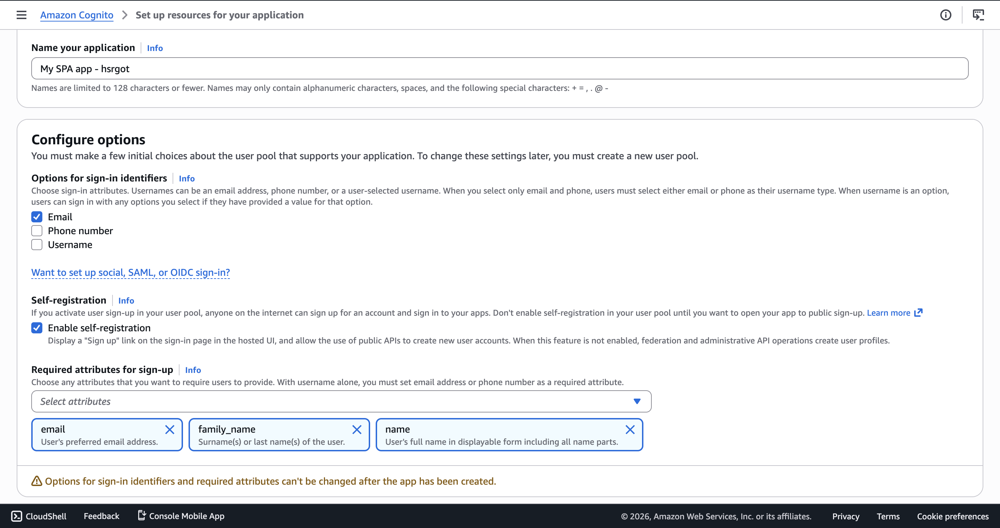
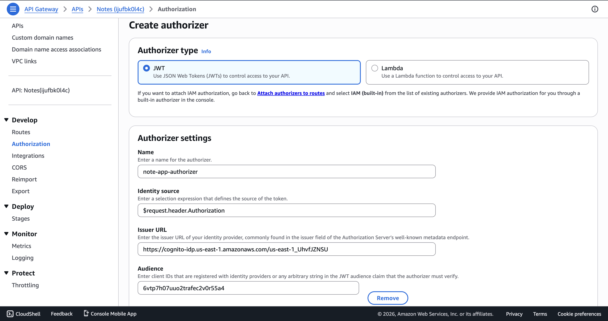
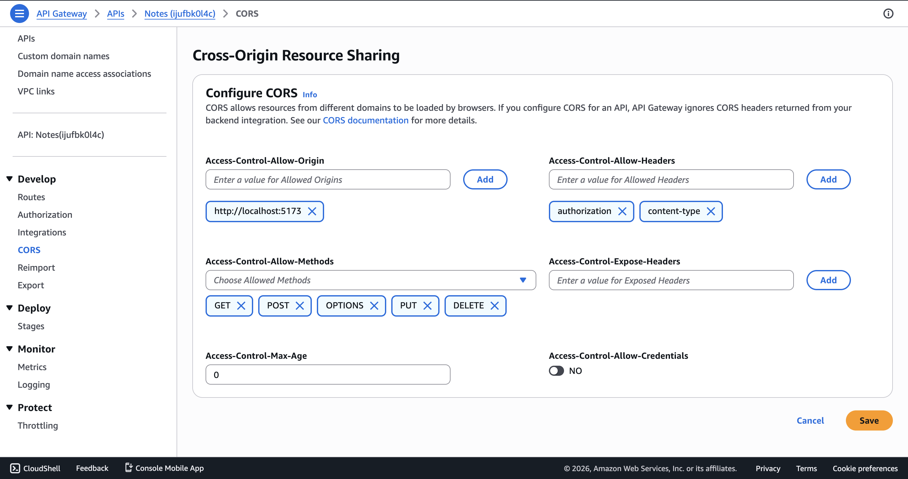

# Securing a Serverless API Gateway API with Amazon Cognito

This documents how I secured my serverless API with Amazon Cognito authentication — from creating the User Pool, to configuring the API Gateway authorizer, to extracting the authenticated user's identity in my Lambda functions.

---

## 1. Create a Cognito User Pool

1. Open the **AWS Console** → **Amazon Cognito** → **Create user pool**
2. Configure the sign-in experience:
   - **Sign-in options**: Select **Email** as the sign-in identifier
3. Configure the password policy and MFA settings according to your requirements
4. Configure the required attributes. For my project the following attributes are required:
   - `email`
   - `name`
   - `family_name`
5. Configure message delivery (Cognito default email or SES)
6. Name your User Pool (e.g. `notes-app-user-pool`)
7. Under **App clients**, create an app client:
   - Set an **App client name** (e.g. `notes-app-client`)
   - **Do not generate a client secret** (required for browser-based apps using the Cognito Identity JS SDK)
8. Review and **Create** the User Pool
9. Note down the following values — I needed them in both frontend and backend configuration:
   - **User Pool ID** (e.g. `us-east-1_XXXXXXXXX`)
   - **App Client ID** (e.g. `6ptv8h09uuo2cartec2v0r55a4`)



---

## 2. Configure API Gateway Authorizer

### For HTTP API (API Gateway v2)

1. Open **API Gateway** → Select your HTTP API
2. Go to **Authorization** in the left menu
3. Click **Manage authorizers** → **Create**
4. Configure the authorizer:
   - **Authorizer type**: JWT
   - **Name**: e.g. `cognito-jwt-authorizer`
   - **Issuer URL**: `https://cognito-idp.{region}.amazonaws.com/{userPoolId}`
     - Example: `https://cognito-idp.us-east-1.amazonaws.com/us-east-1_XXXXXXXXX`
     - This is the token signing URL that API Gateway uses to verify the JWT signature
   - **Audience**: Your **App Client ID** (e.g. `6ptv8h09uuo2cartec2v0r55a4`)
     - API Gateway validates that the `aud` or `client_id` claim in the token matches this value
5. Click **Create**
6. Go back to **Authorization**, and for each route that needs protection (`GET /notes`, `GET /notes/{noteId}`, `POST /notes`, `PUT /notes/{noteId}`, `DELETE /notes/{noteId}`):
   - Select the route
   - Attach the **cognito-jwt-authorizer**

> **Note:** Do not attach the authorizer to the `OPTIONS` routes — those handle CORS preflight requests and must remain unauthenticated.





### For REST API (API Gateway v1)

If you use a REST API instead of HTTP API, the authorizer setup differs:

1. Go to **Authorizers** in the left menu → **Create New Authorizer**
2. Configure:
   - **Type**: Cognito
   - **Cognito User Pool**: Select your pool
   - **Token Source**: `Authorization`
3. On each resource method, set the **Authorization** to your Cognito authorizer

---

## 3. Update Lambda Functions

With the authorizer in place, API Gateway validates the JWT token before my Lambda is invoked. The authenticated user's `sub` (unique user ID) is available in the event object.

### Extracting the User ID

I replaced the temporary header-based user ID logic:

```javascript
// BEFORE — temporary header-based approach
const userId = event.headers?.["x-user-id"] || "temp-user-id";
```

With the actual Cognito authorizer claims:

**HTTP API (v2):**
```javascript
const userId = event.requestContext.authorizer.jwt.claims.sub;
```

**REST API (v1):**
```javascript
const userId = event.requestContext.authorizer.claims.sub;
```

### Key Difference Between API Types

| | HTTP API (v2) | REST API (v1) |
|---|---|---|
| **Claims path** | `event.requestContext.authorizer.jwt.claims` | `event.requestContext.authorizer.claims` |
| **Authorizer type** | JWT authorizer (built-in) | Cognito User Pool authorizer |
| **Token validation** | Done by API Gateway natively | Done by API Gateway natively |

The extra `.jwt` level in HTTP API v2 is because HTTP APIs support multiple authorizer types, so claims are namespaced under the authorizer type.

### Applied Change

I applied this update to all five of my Lambda functions:

- `createNote/createNote.mjs`
- `getNote/getNote.mjs`
- `getNotes/getNotes.mjs`
- `updateNote/updateNote.mjs`
- `deleteNote/deleteNote.mjs`

Each function now uses:

```javascript
const userId = event.requestContext.authorizer.jwt.claims.sub;
```

This ensures that every database operation (create, read, update, delete) is scoped to the authenticated user's identity as verified by Cognito. No more hardcoded or header-based user IDs.

---

## 4. How It All Fits Together

```
Client (Browser)
    │
    │  Authorization: Bearer <access_token>
    ▼
API Gateway (HTTP API)
    │
    │  1. Validates JWT signature using Cognito Issuer URL
    │  2. Checks audience matches App Client ID
    │  3. Rejects request with 401 if token is invalid/expired
    │
    ▼
Lambda Function
    │
    │  event.requestContext.authorizer.jwt.claims.sub → userId
    │
    ▼
DynamoDB (query scoped to userId)
```

- My **frontend** obtains tokens by authenticating with Cognito (sign-up, confirm, sign-in flows using `amazon-cognito-identity-js`)
- My **axios interceptor** attaches the access token as a `Bearer` header to every API request and handles token refresh
- **API Gateway** validates the token — invalid or expired tokens are rejected with a `401 Unauthorized` before reaching my Lambda
- My **Lambda functions** trust the claims from API Gateway and use `sub` as the user's unique identifier for all database operations
