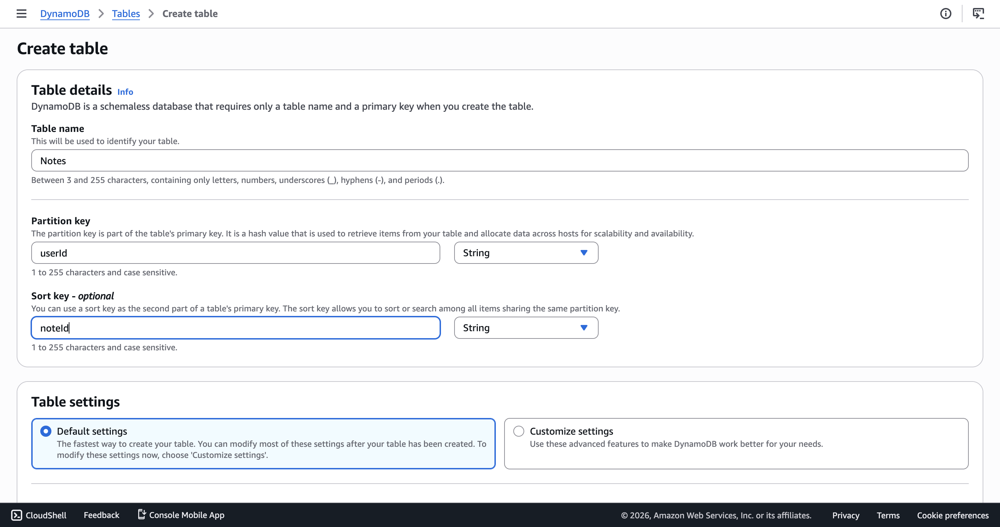
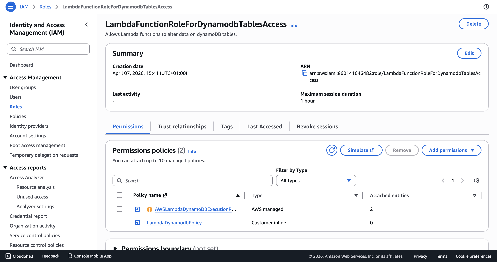
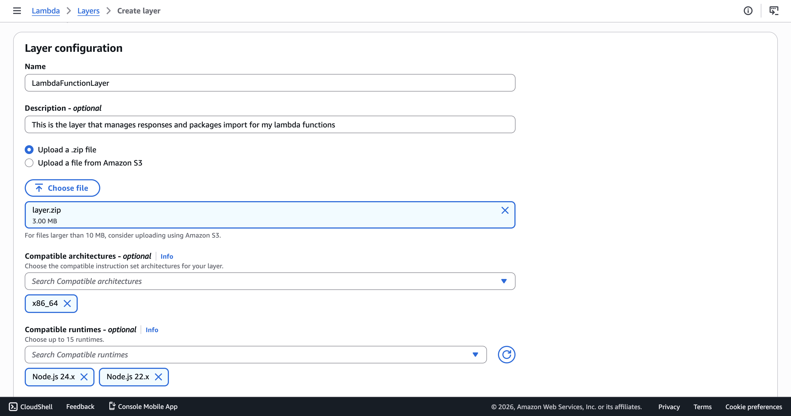
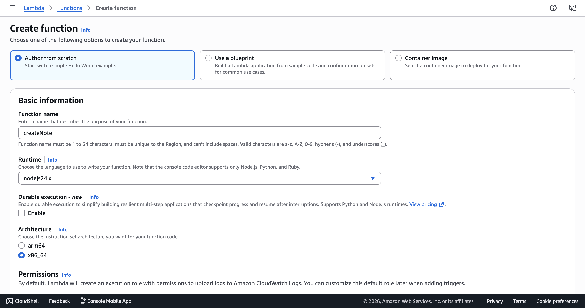
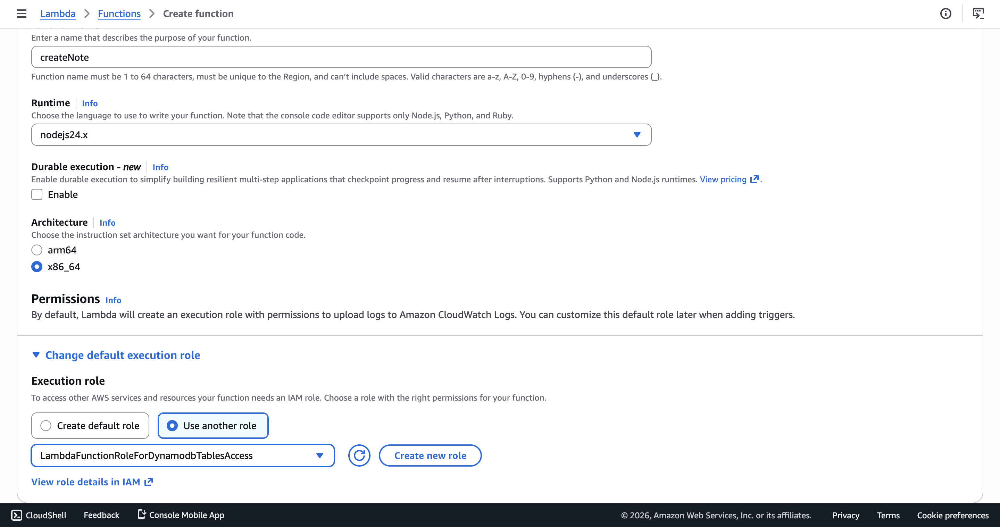
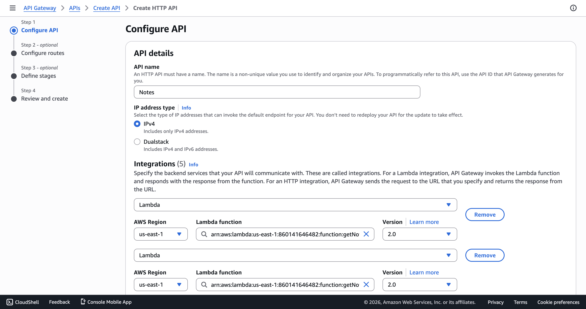
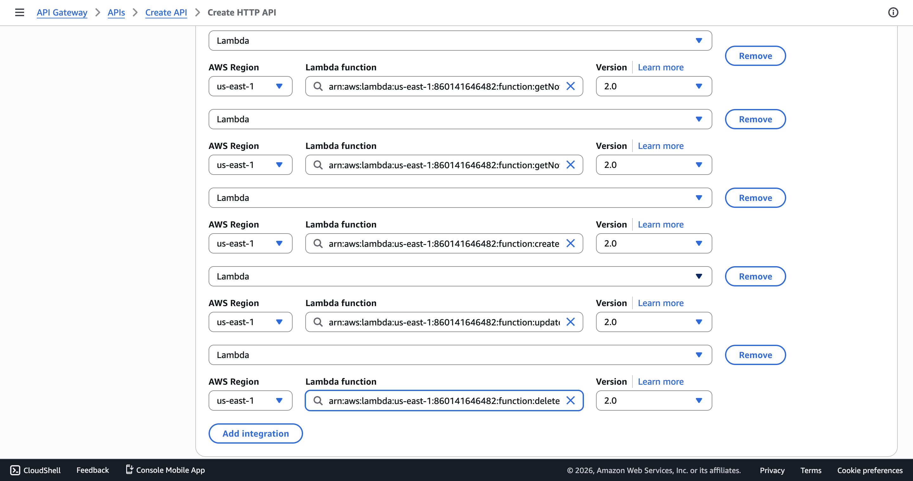
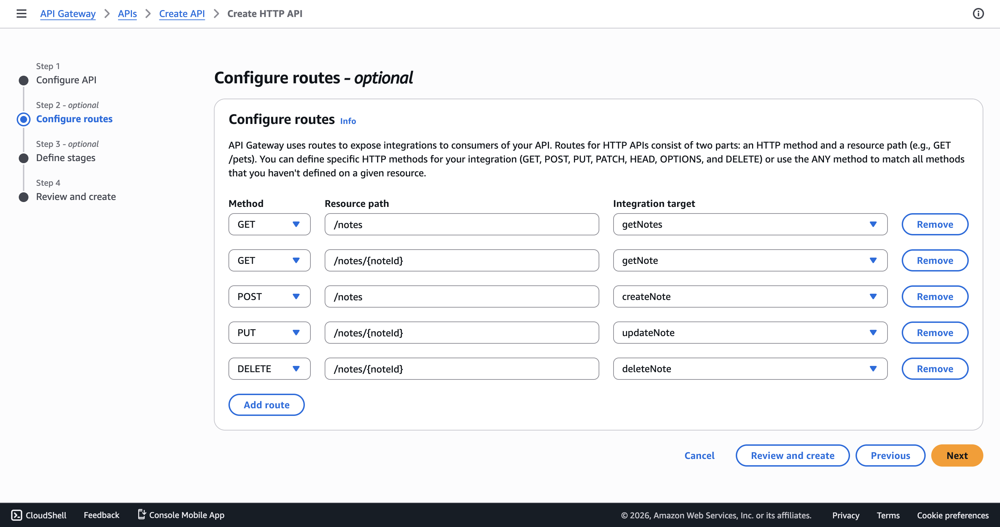

# Lambda Functions & DynamoDB Setup

This document walks through the full backend setup for the serverless Notes app. It covers creating the DynamoDB table, setting up IAM roles, building the Lambda Layer and CRUD functions, and wiring everything together through API Gateway.

At this stage, Cognito is not yet configured, so user identification is handled through a temporary HTTP header (`x-user-id`). Once the Cognito User Pool is in place, each function will extract the userId from the JWT token instead.

---

## Table of Contents

1. [DynamoDB Table](#1-dynamodb-table)
2. [IAM Role for Lambda](#2-iam-role-for-lambda)
3. [Lambda Layer (Shared Code)](#3-lambda-layer-shared-code)
4. [Lambda Functions](#4-lambda-functions)
5. [API Gateway Setup](#5-api-gateway-setup)
6. [Testing with Postman](#6-testing-with-postman)
7. [Important Notes](#7-important-notes)

---

## 1. DynamoDB Table

The first thing to set up is the database. We are using DynamoDB, a fully managed NoSQL database from AWS that fits perfectly with serverless architectures because it scales automatically and charges per request.

The table is named **Notes** and uses a composite primary key:

| Setting        | Value                  |
|----------------|------------------------|
| Table Name     | `Notes`                |
| Partition Key  | `userId` (String)      |
| Sort Key       | `noteId` (String)      |
| Billing Mode   | On-demand (PAY_PER_REQUEST) |

The partition key (`userId`) groups all notes by user, and the sort key (`noteId`) uniquely identifies each note within that group. This means we can query all notes for a specific user efficiently without needing any secondary indexes.

Each item in the table follows this structure:

```json
{
  "userId": "user-uuid",
  "noteId": "generated-uuid-v4",
  "title": "Meeting notes",
  "content": "Discussion points from today...",
  "createdAt": "2026-04-07T10:00:00.000Z",
  "updatedAt": "2026-04-07T12:00:00.000Z"
}
```

To create the table, head to the DynamoDB console, click **Create table**, fill in the table name and key attributes as shown below, and leave the table settings on **Default settings** (which uses on-demand billing).



---

## 2. IAM Role for Lambda

Before creating any Lambda function, we need an execution role that grants two things: permission to write logs to CloudWatch (so we can debug) and permission to interact with our DynamoDB table.

We created a role called **LambdaFunctionRoleForDynamodbTablesAccess**. This single role is shared across all five Lambda functions.



The role has two policies attached:

### AWS Managed Policy

**AWSLambdaDynamoDBExecutionRole** provides CloudWatch Logs permissions so Lambda can write execution logs. This is essential for debugging and monitoring.

### Custom Inline Policy (Least Privilege)

On top of the managed policy, we added a custom inline policy called **LambdaDynamodbPolicy** that grants only the specific DynamoDB actions our functions need:

```json
{
  "Version": "2012-10-17",
  "Statement": [
    {
      "Sid": "LambdaDynamodbAccess",
      "Effect": "Allow",
      "Action": [
        "dynamodb:BatchGetItem",
        "dynamodb:BatchWriteItem",
        "dynamodb:ConditionCheckItem",
        "dynamodb:PutItem",
        "dynamodb:DeleteItem",
        "dynamodb:GetItem",
        "dynamodb:UpdateItem",
        "dynamodb:Query",
        "dynamodb:Scan"
      ],
      "Resource": "arn:aws:dynamodb:*:860141646482:table/*"
    }
  ]
}
```


This follows the principle of least privilege. The functions can read, write, update, delete, and query items, but they cannot create or delete tables, manage indexes, or do anything outside of DynamoDB.

---

## 3. Lambda Layer

All five Lambda functions share certain logic: the DynamoDB client setup, the table name, the DynamoDB commands, and the HTTP response formatting. Instead of duplicating this code in every function, we packaged it into a Lambda Layer.

### Folder Structure

```
backend/layers/
└── nodejs/
    ├── shared/
    │   ├── dynamodb.mjs
    │   └── response.mjs
    ├── node_modules/   
    └── package.json
```

When Lambda extracts the layer, the contents land at `/opt` on the execution environment.
Now the `nodejs/` folder name matters because the nodejs lambda runtime looks for dependencies in the `nodejs/node_modules` directory within /opt.
Our functions then import from `/opt/nodejs/shared/dynamodb.mjs`.

### dynamodb.mjs

This file initializes the DynamoDB Document Client and re-exports all the commands the functions need. 

```js
import { DynamoDBClient } from "@aws-sdk/client-dynamodb";
import {
  DynamoDBDocumentClient,
  GetCommand,
  PutCommand,
  DeleteCommand,
  UpdateCommand,
  ScanCommand,
  QueryCommand,
} from "@aws-sdk/lib-dynamodb";

const client = new DynamoDBClient({});

export const docClient = DynamoDBDocumentClient.from(client, {
  marshallOptions: {
    removeUndefinedValues: true,
  },
});

export const TABLE_NAME = process.env.NOTES_TABLE || "Notes";

export {
  GetCommand,
  PutCommand,
  DeleteCommand,
  UpdateCommand,
  ScanCommand,
  QueryCommand,
};
```

The `removeUndefinedValues: true` option is a small but important detail. It tells the Document Client to silently strip any `undefined` fields before sending data to DynamoDB, which prevents errors during partial updates where some fields may not be provided.

The table name is read from an environment variable with a fallback to `"Notes"`.

### response.mjs

This file standardizes all HTTP responses returned by our Lambda functions. Every response includes CORS headers (which will be needed once the frontend calls the API from the browser) and proper JSON formatting.

```js
const ALLOWED_ORIGIN = process.env.ALLOWED_ORIGIN || "https://note.domain.app";

const headers = {
  "Content-Type": "application/json",
  "Access-Control-Allow-Origin": ALLOWED_ORIGIN,
  "Access-Control-Allow-Headers": "Content-Type, Authorization",
  "Access-Control-Allow-Methods": "GET, POST, PUT, DELETE, OPTIONS",
};

function buildResponse(statusCode, body) {
  return {
    statusCode,
    headers,
    body: JSON.stringify(body),
  };
}

export function success(body) {
  return buildResponse(200, body);
}

export function created(body) {
  return buildResponse(201, body);
}

export function badRequest(message) {
  return buildResponse(400, { message });
}

export function unauthorized(message = "Unauthorized") {
  return buildResponse(401, { message });
}

export function notFound(message = "Resource not found") {
  return buildResponse(404, { message });
}

export function error(statusCode, message, err = null) {
  const body = { message };
  if (err) {
    body.error = {
      name: err.name,
      details: err.message,
      ...(err.code && { code: err.code }),
    };
  }
  return buildResponse(statusCode, body);
}
```


### Deploying the Layer

The layer needs to be zipped and uploaded to AWS using the command `npm run zip:layer` from the backend directory.The zip compresses the entire `nodejs/` folder, including `node_modules/`, `shared/`, and `package.json`.

When creating the layer in the AWS console, set the compatible runtimes to Node.js 22.x and Node.js 24.x and choose your appropriate architecture(I choosed x86_64 but arm is more cost effective for a demo). We uploaded the `layer.zip` and named it **LambdaFunctionLayer**.



---

## 4. Lambda Functions

We built five functions, one for each CRUD operation plus a "get all" endpoint. Each function lives in its own folder under `backend/functions/`, and each file is named after the function it implements.

### Creating the Functions on AWS

For every function, the creation steps are the same:

1. Go to Lambda > Create function > Author from scratch
2. Enter the function name (e.g., `createNote`)
3. Set the runtime to **Node.js 24.x**
4. Under **Change default execution role**, select **Use an existing role** and choose **LambdaFunctionRoleForDynamodbTablesAccess**
5. Create the function





After creating each function:

1. Upload the corresponding zip file (from `npm run zip:functions`)
2. Go to the **Layers** section and attach the **LambdaFunctionLayer**


### Handler Configuration

This is an important detail. By default, Lambda expects the handler to be at `index.handler`, meaning it looks for a file called `index.mjs` with an exported function called `handler`. Since our files are named after the function (e.g., `createNote.mjs`, `getNote.mjs`), you need to update the handler setting for each function.

| Function    | Handler Setting         |
|-------------|-------------------------|
| createNote  | `createNote.handler`    |
| getNotes    | `getNotes.handler`      |
| getNote     | `getNote.handler`       |
| updateNote  | `updateNote.handler`    |
| deleteNote  | `deleteNote.handler`    |

If you skip this step, the function will crash with a `Runtime.HandlerNotFound` error when invoked.

### Temporary User Identification

Since Cognito is not set up yet, all functions read the user ID from a custom HTTP header called `x-user-id`. This is a temporary workaround for testing. The relevant line in every function looks like this:

```js
const userId = event.headers?.["x-user-id"] || "temp-user-id";
```

Once the Cognito User Pool is configured and a Cognito Authorizer is attached to API Gateway, this line will be replaced with:

```js
const userId = event.requestContext.authorizer.claims.sub;
```

The `sub` claim in a Cognito JWT token is the unique, immutable user identifier.

### createNote

**Endpoint:** `POST /notes`

This function handles new note creation. It validates the incoming `title` and `content` fields, generates a unique `noteId` using `crypto.randomUUID()`, and writes the item to DynamoDB with a `ConditionExpression` that prevents overwriting an existing note with the same ID.

The `attribute_not_exists(noteId)` condition is a nice trick. It turns the `PutCommand` (which normally overwrites silently) into a conditional insert that fails if the item already exists.

```js
await docClient.send(
  new PutCommand({
    TableName: TABLE_NAME,
    Item: {
      userId,
      noteId,
      title: title.trim(),
      content: content.trim(),
      createdAt: now,
      updatedAt: now,
    },
    ConditionExpression: "attribute_not_exists(noteId)",
  })
);
```

Returns **201 Created** on success with the full note object.

### getNotes

**Endpoint:** `GET /notes`

Queries DynamoDB for all notes belonging to the current user. It uses the `QueryCommand` with a `KeyConditionExpression` that matches on the partition key (`userId`). This is efficient because DynamoDB goes directly to the right partition rather than scanning the entire table.

The results come back sorted by the sort key, So we sort the notes using `createdAt` to put the newest notes first.

```js
const notes = (result.Items || []).sort(
  (a, b) => new Date(b.createdAt) - new Date(a.createdAt)
);
```

Returns **200 OK** with the note count and the sorted array.

### getNote

**Endpoint:** `GET /notes/{noteId}`

Fetches a single note by its composite key (`userId` + `noteId`). Uses the `GetCommand`, which is a direct key lookup and the cheapest possible read operation in DynamoDB.

If no item is found, `result.Item` comes back as `undefined`. DynamoDB does not throw an error for missing items, so we check explicitly and return a **404 Not Found** response.

### updateNote

**Endpoint:** `PUT /notes/{noteId}`


The function uses `ExpressionAttributeNames` (the `#t`, `#c`, `#u` aliases) even though our attribute names are not reserved words in DynamoDB. This is a defensive practice that prevents breakage if you ever add an attribute with a reserved word name.

The `ConditionExpression: "attribute_exists(noteId)"` ensures the update only applies if the item actually exists.

The `ReturnValues: "ALL_NEW"` option tells DynamoDB to send back the complete updated item.

### deleteNote

**Endpoint:** `DELETE /notes/{noteId}`

Deletes a note with two safety checks baked into the `ConditionExpression`:

```js
ConditionExpression: "attribute_exists(noteId) AND userId = :uid"
```

---

## 5. API Gateway Setup

With all five functions deployed and tested individually through the Lambda console, the next step is to expose them through API Gateway so they can be called over HTTP.

We created an **HTTP API** (not a REST API) named **Notes**. HTTP APIs are simpler, cheaper, and faster than REST APIs, and they cover everything we need for this project.



### Integrations

Each Lambda function was added as an integration. API Gateway connects to the functions using their ARNs directly.



### Routes

We defined five routes, each mapping an HTTP method and path to the corresponding Lambda integration:

| Method   | Path               | Integration  |
|----------|-------------------|--------------|
| GET      | `/notes`          | getNotes     |
| POST     | `/notes`          | createNote   |
| GET      | `/notes/{noteId}` | getNote      |
| PUT      | `/notes/{noteId}` | updateNote   |
| DELETE   | `/notes/{noteId}` | deleteNote   |



The `{noteId}` in the path is a path parameter. API Gateway captures whatever value is in that URL segment and passes it to the Lambda function through `event.pathParameters.noteId`.

### Deployment Stage

We set the stage name to **prod** with auto-deploy enabled. This means any change to the API configuration is automatically deployed without needing to manually push updates.

After creation, API Gateway provides an invoke URL that looks something like:

```
https://xxxxxxxxxx.execute-api.us-east-1.amazonaws.com/prod
```

This is the base URL for all our API calls.

---

## 6. Testing with Postman

With the API Gateway deployed, you can test every endpoint using Postman (or any HTTP client). The base URL follows this pattern:

```
https://<api-id>.execute-api.us-east-1.amazonaws.com/prod
```

Since we are not using Cognito yet, remember to include the `x-user-id` header in every request.

### Create a Note

```
POST /prod/notes
Header: x-user-id: test-user-001
Body:
{
  "title": "My First Note",
  "content": "This is a test note created through the API"
}
```

Expected response: **201 Created** with the full note object including the generated `noteId`.

### Get All Notes

```
GET /prod/notes
Header: x-user-id: test-user-001
```

Expected response: **200 OK** with a `count` and `notes` array sorted by newest first.

### Get a Single Note

```
GET /prod/notes/{noteId}
Header: x-user-id: test-user-001
```

Replace `{noteId}` with the actual ID returned from the create call.

### Update a Note

```
PUT /prod/notes/{noteId}
Header: x-user-id: test-user-001
Body:
{
  "title": "Updated Title"
}
```

Only the fields you include will be updated. The `updatedAt` timestamp is refreshed automatically.

### Delete a Note

```
DELETE /prod/notes/{noteId}
Header: x-user-id: test-user-001
```

Expected response: **200 OK** with a confirmation message. Calling the same endpoint again should return **404 Not Found**.

---

## 7. Important Notes

A few things to keep in mind at this stage of the project:

**This is a temporary setup.** The `x-user-id` header is a stand-in for proper authentication.

**The Lambda Layer and functions must use the same architecture.** If you create the layer with x86_64, all functions must also use x86_64. Mixing architectures will cause import failures at runtime.

**Handler naming matters.** Since our files are not named `index.mjs`, you must update each function's handler to `<filename>.handler`. 

